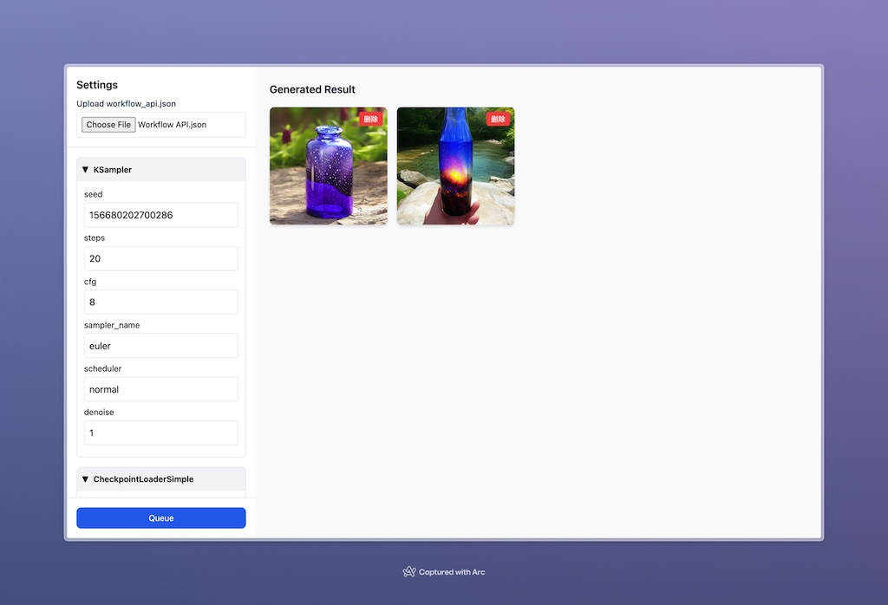

A minimalist ComfyUI front-end application that can read `workflow_api.json` files and generate corresponding forms. Click `Queue` to initiate an image generation request.

## How to use

**STEP 1:** Use the command to start ComfyUI in the current computer

```shell
python main.py --enable-cors-header
```

**STEP 2:** Open [jaylyu.github.io/ComfyUI_Web_Lite/](https://jaylyu.github.io/ComfyUI_Web_Lite/), upload the `workflow_api.json` file and you can use it.

You can also clone the repository to use locally:

1. Clone the repository to local: `git clone https://github.com/JayLyu/ComfyUI_Web_Lite.git`

2. Use VsCode's _Open with Live Serve_ feature to open `index.html`

3. Visit: [http://127.0.0.1:5500/index.html](http://127.0.0.1:5500/index.html)

## TODO

- ~~ Single html application~~
- ~~ Image storage in LocalStorage~~
- ~~ Style optimization~~
- ~~ Hide the configuration of specific fields~~
- Generate checkpoints, loras... and other models Select selector
